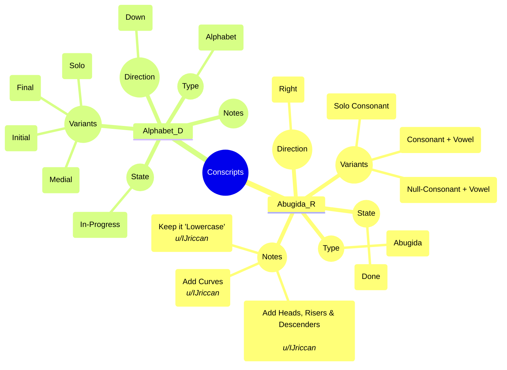

# Planned Conscripts

- Conscripts
	- Abugida_R
		- State
			- Done
		- Type
			- Abugida
		- Direction
			- Right
		- Variants
			- Solo Consonant
			- Consonant + Vowel
			- Null-Consonant + Vowel
		- Notes
			- Add Curves
				- *u/IJriccan*
			- Add Heads, Risers & Descenders
				- *u/IJriccan*
			- Keep it 'Lowercase'
				- *u/IJriccan*
	- Alphabet_D
		- State
			- In-Progress
		- Type
			- Alphabet
		- Direction
			- Down
		- Variants
			- Solo
			- Initial
			- Medial
			- Final
		- Notes