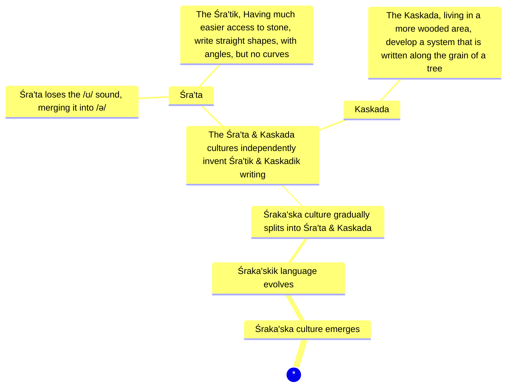
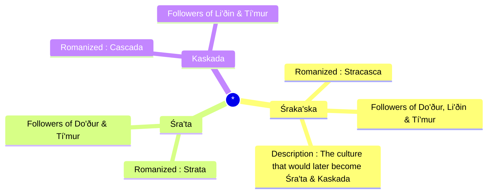
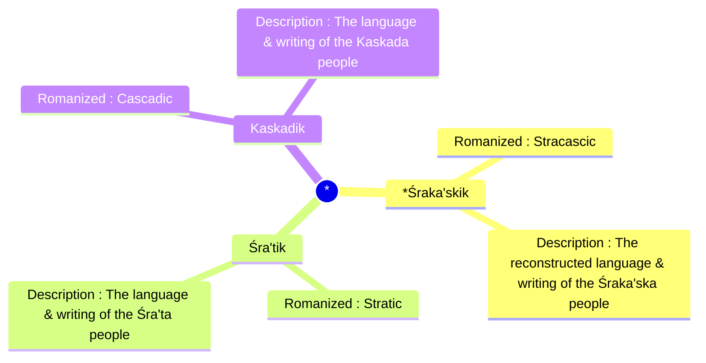
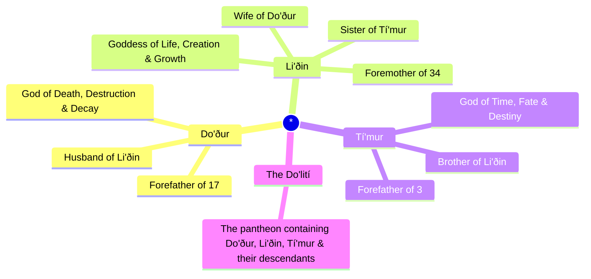
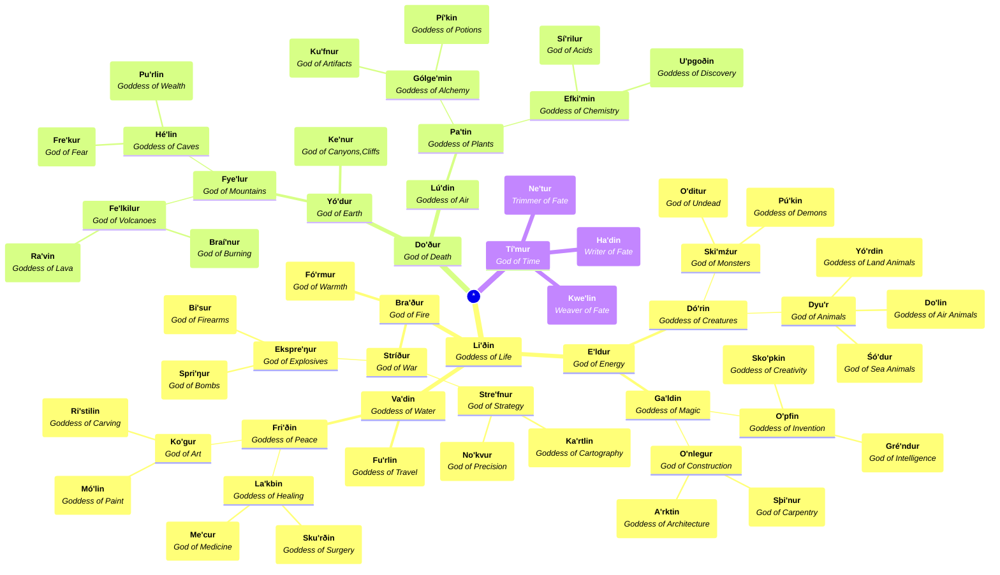

# Timeline

```mermaid
mindmap
((*))
	Śraka'ska culture emerges
		Śraka'skik language evolves
			Śraka'ska culture gradually splits into Śra'ta & Kaskada
				The Śra'ta & Kaskada cultures independently invent Śra'tik & Kaskadik writing
					Śra'ta
						Śra'ta loses the /ʊ/ sound, merging it into /ə/
						The Śra'tik, Having much easier access to stone, write straight shapes, with angles, but no curves
					Kaskada
						The Kaskada, living in a more wooded area, develop a system that is written along the grain of a tree
```
# Cultures

```mermaid
mindmap
((*))
	Śraka'ska
		Romanized : Stracasca
		Followers of Do'ður, Li'ðin & Tí'mur
		Description : The culture that would later become Śra'ta & Kaskada
	Śra'ta
		Romanized : Strata
		Followers of Do'ður & Tí'mur
	Kaskada
		Romanized : Cascada
		Followers of Li'ðin & Tí'mur
```
# Languages

```mermaid
mindmap
((*))
	*Śraka'skik
		Romanized : Stracascic
		Description : The reconstructed language & writing of the Śraka'ska people
	Śra'tik
		Romanized : Stratic
		Description : The language & writing of the Śra'ta people
	Kaskadik
		Romanized : Cascadic
		Description : The language & writing of the Kaskada people
```
# Deities

```mermaid
mindmap
((*))
	Do'ður
		God of Death, Destruction & Decay
		Husband of Li'ðin
		Forefather of 17
	Li'ðin
		Goddess of Life, Creation & Growth
		Wife of Do'ður
		Sister of Tí'mur
		Foremother of 34
	Tí'mur
		God of Time, Fate & Destiny
		Brother of Li'ðin
		Forefather of 3
	The Do'lití
		The pantheon containing Do'ður, Li'ðin, Tí'mur & their descendants
```
# Genealogy

```mermaid
mindmap
((*))
	**Li'ðin**<br>*Goddess of Life*
		**E'ldur**<br>*God of Energy*
			**Dó'rin**<br>*Goddess of Creatures*
				**Ski'mźur**<br>*God of Monsters*
					(**O'ditur**<br>*God of Undead*)
					(**Pú'kin**<br>*Goddess of Demons*)
				**Dyu'r**<br>*God of Animals*
					(**Do'lin**<br>*Goddess of Air Animals*)
					(**Yó'rdin**<br>*Goddess of Land Animals*)
					(**Śó'dur**<br>*God of Sea Animals*)
			**Ga'ldin**<br>*Goddess of Magic*
				**O'pfin**<br>*Goddess of Invention*
					(**Gré'ndur**<br>*God of Intelligence*)
					(**Sko'pkin**<br>*Goddess of Creativity*)
				**O'nlegur**<br>*God of Construction*
					(**Sþi'nur**<br>*God of Carpentry*)
					(**A'rktin**<br>*Goddess of Architecture*)
		**Bra'ður**<br>*God of Fire*
			**Stríður**<br>*God of War*
				**Ekspre'ŋur**<br>*God of Explosives*
					(**Bi'sur**<br>*God of Firearms*)
					(**Spri'ŋur**<br>*God of Bombs*)
				**Stre'fnur**<br>*God of Strategy*
					(**Ka'rtlin**<br>*Goddess of Cartography*)
					(**No'kvur**<br>*God of Precision*)
			(**Fó'rmur**<br>*God of Warmth*)
		**Va'din**<br>*Goddess of Water*
			**Fri'ðin**<br>*Goddess of Peace*
				**La'kbin**<br>*Goddess of Healing*
					(**Sku'rðin**<br>*Goddess of Surgery*)
					(**Me'cur**<br>*God of Medicine*)
				**Ko'gur**<br>*God of Art*
					(**Ri'stilin**<br>*Goddess of Carving*)
					(**Mó'lin**<br>*Goddess of Paint*)
			(**Fu'rlin**<br>*Goddess of Travel*)
	**Do'ður**<br>*God of Death*
		**Yó'dur**<br>*God of Earth*
			**Fye'lur**<br>*God of Mountains*
				**Fe'lkilur**<br>*God of Volcanoes*
					(**Ra'vin**<br>*Goddess of Lava*)
					(**Braí'nur**<br>*God of Burning*)
				**Hé'lin**<br>*Goddess of Caves*
					(**Fre'kur**<br>*God of Fear*)
					(**Pu'rlin**<br>*Goddess of Wealth*)
			(**Ke'nur**<br>*God of Canyons,Cliffs*)
		**Lú'din**<br>*Goddess of Air*
			**Pa'tin**<br>*Goddess of Plants*
				**Gólge'min**<br>*Goddess of Alchemy*
					(**Ku'fnur**<br>*God of Artifacts*)
					(**Pí'kin**<br>*Goddess of Potions*)
				**Efki'min**<br>*Goddess of Chemistry*
					(**Sí'rilur**<br>*God of Acids*)
					(**U'pgoðin**<br>*Goddess of Discovery*)
	**Tí'mur**<br>*God of Time*
		(**Kwe'lin**<br>*Weaver of Fate*)
		(**Ha'din**<br>*Writer of Fate*)
		(**Ne'tur**<br>*Trimmer of Fate*)
```